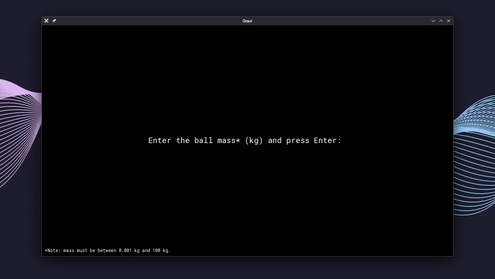

# Gravr, simulating physics with SFML

Gravr is a real-time 2D physics simulation that models falling objects under the influence of gravity and air resistance. Built with C++ and SFML, the simulation supports accurate drag computation, collision physics, and user interaction through keyboard controls.

## Features

* Realistic gravitational motion using Newton's second law
* Drag force modeling based on Reynolds number and fluid dynamics
* Ball type classification based on mass input
* Ground collision with energy loss (coefficient of restitution)
* Real-time graphical display with height, velocity, and timer
* User controls for pausing, resuming, and resetting the simulation
* Adjustable mass (0.001–100 kg) and height (1–10 m)

## Example



## Physics model

### Gravitational force

```cpp
F_gravity = m * g
g = 9.81 m/s²
```

### Air resistance

Drag is computed using the standard drag force equation:

```cpp
F_drag = 0.5 * ρ * v² * C_d * A
```

Where:

* `ρ` = air density (1.225 kg/m³)
* `v` = velocity
* `C_d` = drag coefficient
* `A` = cross-sectional area of the sphere

#### Reynolds number

```cpp
Re = (ρ * v * D) / μ
```

* `D` = ball diameter
* `μ` = dynamic viscosity of air

#### Drag coefficient calculation

| Regime        | Condition           | Equation                                |
| ------------- | ------------------- | ----------------------------------------|
| Stokes flow   | Re < 0.1            | C_d = 24 / Re                           |
| Intermediate  | 0.1 ≤ Re < 1000     | C_d = 24 / Re \* (1 + 0.15 \* Re^0.687) |
| Turbulent     | 1000 ≤ Re < 300,000 | C_d = 0.44                              |
| Post-critical | Re ≥ 300,000        | C_d = 0.1                               |

### Collision model

Ground collisions apply a fixed coefficient of restitution (COR = 0.7):

```cpp
v_after = -COR * v_before
```

The simulation ends when the bounce speed falls below 2.0 m/s.

### Integration

Euler integration is used to update velocity and position:

```cpp
acceleration = force / mass
velocity += acceleration * dt
position += velocity * dt
```

## Controls

| Key       | Action         |
| --------- | -------------- |
| Enter     | Start / Resume |
| Backspace | Pause          |
| 0         | Reset          |
| Escape    | Exit           |

## Ball type classification

Gravr assigns a label based on the selected mass:

| Mass Range (kg) | Ball Type             |
| --------------- | --------------------- |
| 0.001 – 0.003   | Ping pong             |
| 0.003 – 0.05    | Racquet ball          |
| 0.05 – 0.065    | Tennis ball           |
| 0.065 – 0.16    | Baseball              |
| 0.16 – 0.5      | Soccer ball           |
| 0.5 – 0.7       | Basketball            |
| 0.7 – 8.0       | Bowling ball          |
| 8.0 – 20.0      | Light medicine ball   |
| 20.0 – 50.0     | Heavy medicine ball   |
| 50.0 – 100.0    | Industrial ball       |

## Project structure

```
gravr/
├── src/
│   ├── main.cpp                       # Application entry point
│   ├── Simulation.cpp/.h              # Main simulation loop and logic
│   ├── Particle.cpp/.h                # Physics calculations and particle state
│   ├── UIManager.cpp/.h               # User interface and rendering
│   └── InputHandler.cpp/.h            # User input processing
├── assets/fonts/
|   └── RobotoMono-Regular.ttf         # Font used
├── build/                             # Build directory (created by CMake)
├── CMakeLists.txt                     # Build configuration
└── README.md
```

## Build instructions

### Requirements

* C++17-compatible compiler
* CMake 3.10 or higher
* SFML 3.0.0 or higher

### Linux

#### Debian/Ubuntu

```bash
sudo apt update
sudo apt install build-essential cmake libsfml-dev
```

#### Arch Linux

```bash
sudo pacman -Syu
sudo pacman -S base-devel cmake sfml
```

### Compile and run

```bash
git clone https://github.com/chitvs/gravr.git
cd gravr
mkdir build && cd build
cmake ..
make
./bin/main
```

### VS Code build

1. Open the project in VS Code
2. Run `CMake: Build` from the Command Palette (`Ctrl + Shift + P`)
3. Execute the built binary from the `build/` directory

## Configuration

```cpp
const float PIXELS_PER_M = 57.78f;
const float GRAVITY = 9.81f;
const float AIR_DENSITY = 1.225f;
const float AIR_VISCOSITY = 1.81e-5f;
const float BALL_RADIUS = 0.04f;
const float DRAG_MULTIPLIER = 8.0f;
```

## License

This project is licensed under the MIT License.
The included Roboto font is licensed under the Apache License 2.0.
